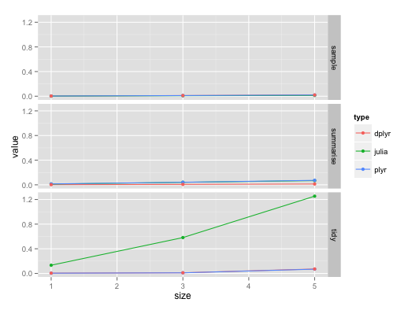
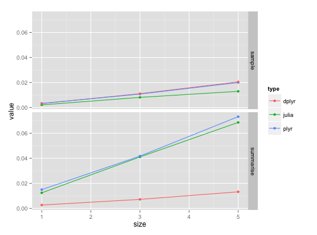

Benchmarking: Hadleyverse vs Julia
========================================================
author: Eric Hare
date: 2014-12-10

DataFrames Package
========================================================

Extends base Julia by adding features needed for statistical computing

- Missing values 
- Data arrays that efficiently store missing values
- Tabular dataset

http://dataframesjl.readthedocs.org/en/latest/introduction.html

RDatasets Package
========================================================
Contains several common datasets that we are used to

using DataFrames, RDatasets
diamonds = dataset("ggplot2", "diamonds")

Emulating the Hadleyverse
========================================================

http://dataframesjl.readthedocs.org/en/latest/split_apply_combine.html

Three Benchmarks
========================================================
1. Summarising a dataset
2. Sampling from a dataset
3. Tidying a dataset

1. Summarising a dataset
========================================================
* In old-hadleyverse, accomplished with plyr::ddply and plyr::summarise
* In new-hadleyverse, accomplished with dplyr::summarise
* In Julia, accomplished with by()

2. Sampling from a dataset
========================================================
* Not really an old hadleyverse... would just use base::sample()
* In new-hadleyverse, accomplished with dplyr::sample_n
* In Julia, accomplished with sample() as well

3. Tidying a dataset
========================================================
* In old-hadleyverse, accomplished with reshape2::melt
* In new-hadleyverse, accomplished with tidyr::gather
* In Julia, accomplished with stack()

Results
========================================================

Results
========================================================

